# C++服务器搭建

## 1.服务器环境及基础知识

### 1.1开发环境

#### Linux操作系统 + GCC/G++（C语言、C++语言编译器）

<table>
    <tr>
        <td>编译器</td>
        <td>基于某种规范，将C++代码转换成可执行程序的某种程序</td>
        <td>MSVC</td>
        <td>GCC/G++</td>
        <td>Clang</td>
    <tr>
    <tr>
        <td>编译环境</td>
        <td>编译器程序需要的具体运行环境（操作系统）</td>
        <td>Windows</td>
        <td>Linux、Cygwin、MinGW</td>
        <td>MacOs</td>
    <tr>
    <tr>
        <td>编辑器</td>
        <td>全称代码编辑器，编写代码的工具程序</td>
        <td colspan = "3">VScode, Vim, Notepad++</td>
    <tr>
    <tr>
        <td>IDE</td>
        <td>包括项目文件管理器、代码编辑器、调试器、编译器等各种开发时的工具集合，通常打包安装</td>
        <td colspan = "3">Visio Studio/编辑器+MinGW/GCC</td>
    <tr>
</table>

```shell
安装命令： sudo apt install gcc g++  
查看版本： gcc/g++ -v/--version
```

#### 汇编过程

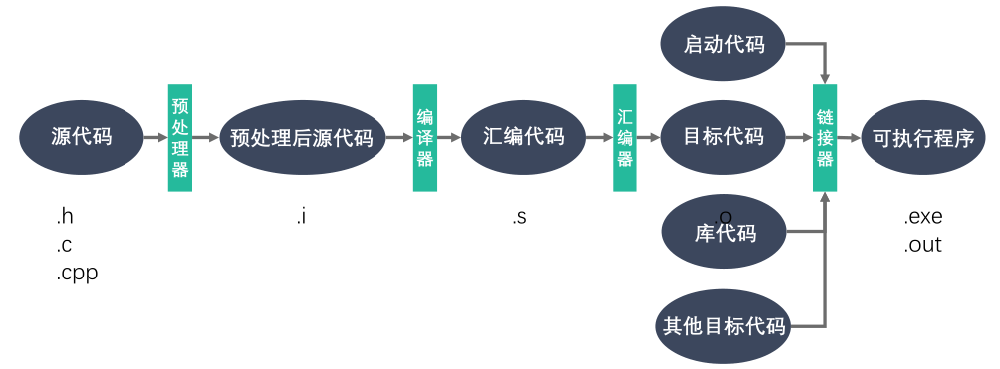

#### gcc/g++常见参数

| 参数 | 作用 |
| -------- | ------------ |
| -std | 指定标准版本 |
| -c | 只激活预处理,编译,和汇编，只把程序做成obj文件 |
| -o | 制定输出目标名称,默认是a.out |
| -I    | 编译时，需要另一个文件，用于设定另一个文件，功能就相当于在代码中使用#include |
| -L dir | 制定编译的时候，搜索库的路径。比如你自己的库，可以用它制定目录，不然编译器将只在标准库的目录找。这个dir就是目录的名称，可无空格 |
| -l lib | 制定编译的时候，使用的库，lib就是库的名称，可无空格          |
| -fpic  | 编译器就生成位置无关目标码.适用于共享库(shared library) |
| -fPIC | 编译器就输出位置无关目标码.适用于动态连接(dynamic linking) |
| -shared | 将使用动态库为默认选项 |

### 1.2库文件

计算机上某一类文件，类似代码仓库，无法单独运行，保密性强，方便分发

静态库：程序链接时，复制进程序中

动态库：程序运行时，系统加载进内存让程序调用

#### 静态库

Linux：libxxx.a — lib固定前缀，xxx为库名称，.a为后缀

Windows：libxxx.lib

**制作调用过程**

```shell
gcc/g++ -c *.c -I ../include //引入头文件，生成.o文件
ar rcs libxxx.a xxx.o xxx.o //生成静态库文件
gcc/g++ main.cpp -o a.out -I ../include -L dir -l xxx//引入库文件，运行程序
```

#### 动态库

Linux：libxxx.so — lib固定前缀，xxx为库名称，.so为后缀

Windows：libxxx.dll

**制作过程**

```shell
gcc/g++ -c -fpic/-fPIC *.c  -I ../include //引入头文件，生成.o文件
gcc/g++ -shared *.o -o libxxx.so  //生成动态库文件
```

**常见问题**

运行过程中缺失依赖库


```shell
ldd app.out//检查app.out动态库依赖关系
```

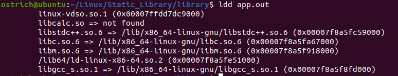

**解决方法**

需要知道库的绝对路径（动态载入器**ld-linux.so**搜索**DT_RPATH**段->环境变量**LD_LIBRARY_PATH**->**/etc/ld.so.cache**文件列表->**/lib/,/usr/lib**目录）

主要通过增加路径至**LD_LIBRARY_PATH**和**/etc/ld.so.cache**文件进行添加

```shell
添加路径：(env查看环境变量，key-value，用：隔开)
1.终端级别添加
export LD_LIBRARY_PATH=$LD_LIBRARY_PATH:/home/ostrich/Linux/Static_Library/library/lib
(关掉终端失效)
echo $LD_LIBRARY_PATH (查看环境变量)

2.用户级别添加(home目录下)
方法1：修改.bashrc(单一用户配置)
vim .bashrc
末尾添加(shift + g)
export LD_LIBRARY_PATH=$LD_LIBRARY_PATH:/home/ostrich/Linux/Static_Library/library/lib
source(.) .bashrc
方法2：修改/etc/profile(全局用户配置)
sudo vim /etc/profile
末尾添加
export LD_LIBRARY_PATH=$LD_LIBRARY_PATH:/home/ostrich/Linux/Static_Library/library/lib
. /etc/profile

4.系统级别添加(home目录下)
sudo vim /etc/ld.so.conf
/home/ostrich/Linux/Static_Library/library/lib
sudo ldconfig
```

#### 两种库的对比

| 库类型 | 优点                                                         | 缺点                                                       |
| ------ | ------------------------------------------------------------ | ---------------------------------------------------------- |
| 静态库 | 1.加载速度快；<br>2.发布程序无需提交静态库，移植方便         | 1.消耗系统资源，浪费内存；<br>2.更新、部署、发布麻烦；     |
| 动态库 | 1.实现进程间资源共享；（共享库）<br>2.更新、部署、发布简单；<br>3.可以控制何时加载动态库； | 1.加载速度比静态库慢；<br>2.发布程序时需提供依赖的动态库； |

### 1.3Makefile

[跟我一起写 Makefile_陈皓](https://seisman.github.io/how-to-write-makefile/)

命名：一般采用Makefile

makefile规则：

```makefile
目标...: 依赖...
	命令（shell 命令）
    ...
```

实际编写makefile文件：

```makefile
#v1.0
app:sub.cpp add.cpp mult.cpp div.cpp main.cpp
        g++ sub.cpp add.cpp mult.cpp div.cpp main.cpp -o app
        
#v2.0
app:sub.o add.o mult.o div.o main.o
        g++ sub.o add.o mult.o div.o main.o -o app

sub.o:sub.cpp
        g++ -c sub.cpp -o sub.o

add.o:add.cpp
        g++ -c add.cpp -o add.o

mult.o:mult.cpp
        g++ -c mult.cpp -o mult.o

div.o:div.cpp
        g++ -c div.cpp -o div.o

main.o:main.cpp
        g++ -c main.cpp -o main.o

#v3.0 使用变量及模式规则
# $<：第一个依赖文件；
# $@：目标；
# $^：所有不重复的依赖文件，以空格分开
obj = sub.o add.o mult.o div.o main.o
target = app
xx = g++

$(target):$(obj)
        $(xx) $(obj) -o $(target)
        
#模式规则：所有的.o文件都由对应的.cpp文件生成
%.o:%.cpp
        $(xx) -c $< -o $@

#v4.0
# wildcard：获取指定目录下指定类型的文件列表；
# patsubst：查找替换；
# .PHONY:伪目标
src = $(wildcard ./*.cpp)#在当前目录下找到所有.cpp文件
obj = $(patsubst %.cpp,%.o,$(src))#在src变量里把所有的.cpp文件转换成.o文件
#obj = $(src:%.cpp=%.0)
target = app
xx = g++

$(target):$(obj)
        $(xx) $(obj) -o $(target)

%.o:%.cpp
        $(xx) -c $< -o $@

.PHONY:clean#clean是伪target，即使存在clean文件依然能执行命令
clean:
        rm -rf $(obj) $(target)

```

### 1.4GDB调试

Linux系统下的代码调试工具，和gcc一起构成完整的开发环境（程序启动、断点、检查、修改）

```shell
g++ program.cpp -o program -g -Wall
#'-g'代表在可执行文件中加入源码信息，保证GDB调试能找到源文件
#'-Wall'表示打开所有warning
```

GDB启动、退出、查看代码

```shell
#启动、退出
gdb program
quit/q

#设置变量
set args 10 20
show args

#帮助命令
help

#查看文件代码
list/l #从默认位置显示
list/l 行号 #从指定行号显示
list/l 函数名 #从指定函数显示

#查看其他文件代码
list/l 文件名:行号
list/l 文件名:函数名

#设置显示行数
show list/listsize
set list/listsize 新显示行数
```

GDB设置断点

```shell
#设置断点
b/break 行号
b/break 函数名 
b/break 文件名：行号
b/break 文件名：函数名
b/break 10 if i==5 #设置条件断点，用于循环

#查看断点
i/info b/break

#删除断点
d/del/delete b/break 断点编号

#取消/使用断点
dis/disable 断点编号
ena/enable 断点编号

```

GDB调试

```shell
#运行代码
start #程序开始调试，停在第一行
run #程序开始调试，遇到断点停止（常用）
finish #跳出函数体
until #跳出循环（循环体中无断点）

#单步调试
c/continue #继续运行到下一个断点
n/next #向下执行一行，不进入函数体
s/step #向下单步调试，遇到函数进入函数体

#变量操作
set var 变量名=变量值 #设置变量，常用在循环
p/print 变量名 #打印变量值
ptype 变量名 #打印变量类型

#自动变量操作
display 变量名 #自动打印变量值
i/info display #查看自动变量
undisplay 编号 #取消自动变量
```

### 1.5文件IO

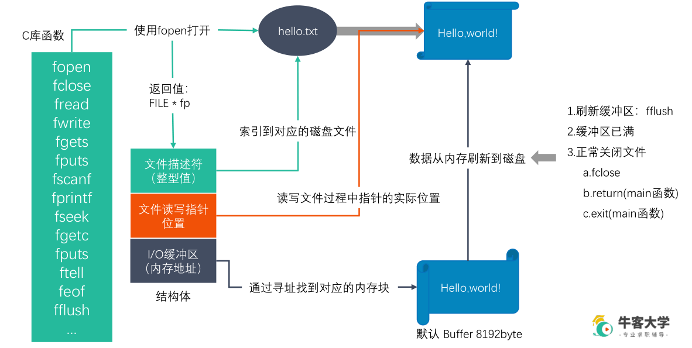

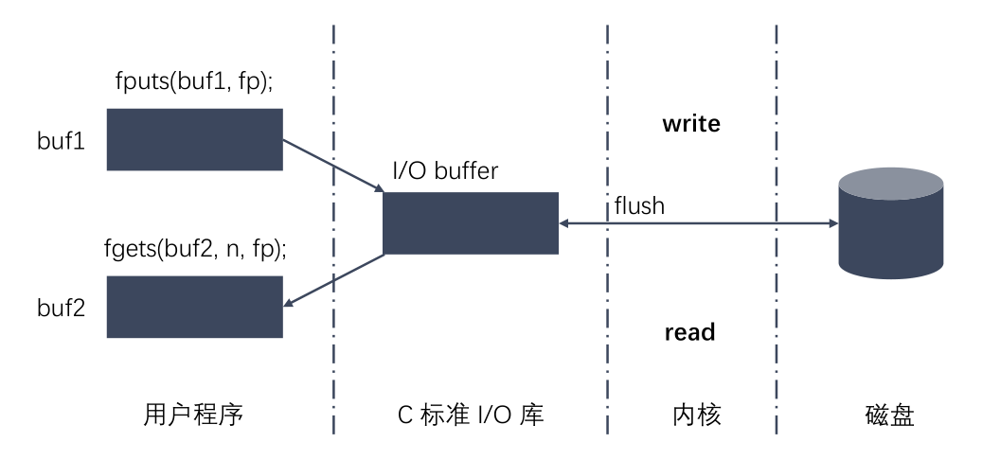

#### [虚拟地址空间](https://blog.csdn.net/lqy971966/article/details/119378416)

**虚拟存储器**

虚拟存储器是一个抽象概念,它为每个进程提供了一个假象,好像每个进程都在独占地使用主存。每个进程看到的存储器都是一致的,**称之为虛拟地址空间**。

地址空间就是每个进程所能访问的内存地址范围，是一段连续的虚拟内存空间。

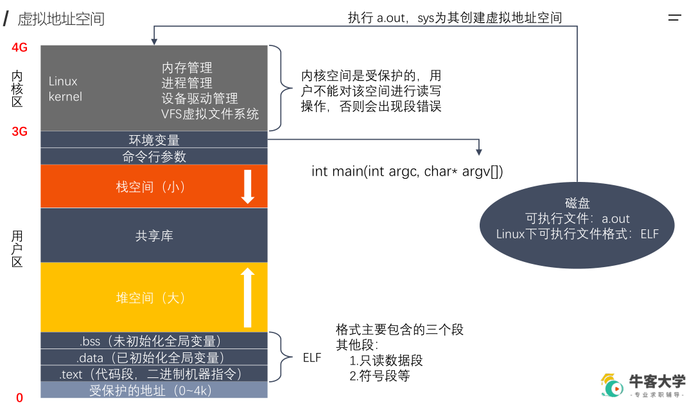

```c++
int main(int argc, char* argv[]); 
//argc是命令行总的参数个数 
//argv[]是argc个参数形成的char数组，其中argv[0]是程序的全名，之后的argv[]代表用户输入的参数
```

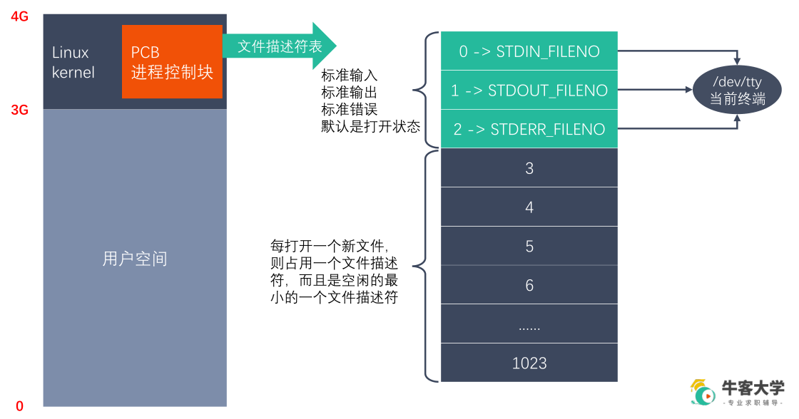


#### Linux下的文件类型

一般用`'ll'`或者`ls -l`查看文件类型时，首位字符代表文件类型，后面9位代表文件操作权限（rwx）

- 普通（`-`）：包括文本文件、编译好的二进制文件、特殊格式的数据文件。
- 目录（`d`）：目录也是文件，允许以操作文件的方式来操作目录。
- 块（`b`）：存储数据以供系统存取的接口设备，也就是硬盘。磁盘中存储数据时，是按块为单位进行存储的，在系统内部按固定大小转移数据。/dev/dsk 对应的为块设备。
- 字符（`c`）：串口设备、键盘、鼠标等，以不定长度转移数据。/dev/rdsk 对应的为字符设备。
- 套接字（`s`）：通常用于网络数据连接。
- 管道（`p`）：用以解决多个程序同时存取一个文件所造成的错误。
- 链接（`l`）：在Linux系统中的链接文件，包括硬链接、软连接两种。


#### man命令

man:查看某个命令的具体参数和使用方法

| 编号 |                 说明                  |                    解释                    |
| :--: | :-----------------------------------: | :----------------------------------------: |
|  1   | Executable programs or shell commands |             **标准Linux命令**              |
|  2   |             System calls              |            **系统调用（内核）**            |
|  3   |           Library functions           |                 **库函数**                 |
|  4   |            Special devices            |    **设备说明**（通常在/dev下可以找到）    |
|  5   |             File formats              |                **文件格式**                |
|  6   |                 Games                 |                 游戏娱乐等                 |
|  7   |             Miscellaneous             |                   杂乱项                   |
|  8   |    System administration commands     | **系统管理员命令**（通常针对**root**用户） |
|  9   |            Kernel routines            |              常规**内核**文件              |

#### Linux系统IO函数

```C++
int open(const char *pathname, int flags);
int open(const char *pathname, int flags, mode_t mode);
int close(int fd);
ssize_t read(int fd, void *buf, size_t count);//sszie_t 32位下为int，64位下为long int
ssize_t write(int fd, const void *buf, size_t count);
off_t lseek(int fd, off_t offset, int whence);
int stat(const char *pathname, struct stat *statbuf);
int lstat(const char *pathname, struct stat *statbuf);
```

**stat结构体**

```c++
struct stat {
    dev_t st_dev; // 文件的设备编号
    ino_t st_ino; // 节点
    mode_t st_mode; // 文件的类型和存取的权限
    nlink_t st_nlink; // 连到该文件的硬连接数目
    uid_t st_uid; // 用户ID
    gid_t st_gid; // 组ID
    dev_t st_rdev; // 设备文件的设备编号
    off_t st_size; // 文件字节数(文件大小)
    blksize_t st_blksize; // 块大小
    blkcnt_t st_blocks; // 块数
    time_t st_atime; // 最后一次访问时间
    time_t st_mtime; // 最后一次修改时间
    time_t st_ctime; // 最后一次改变时间(指属性)
};
```

**st_mode变量**

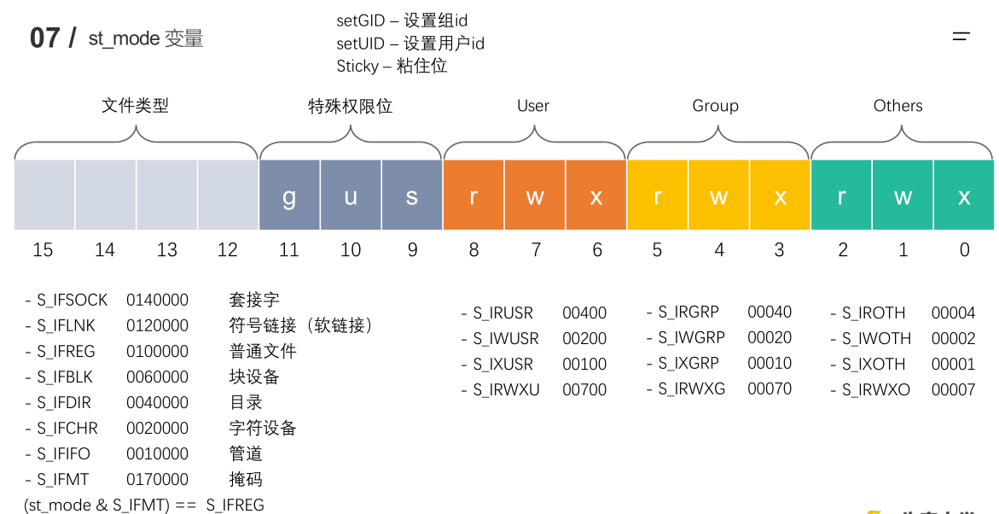

#### 文件属性操作函数

```C++
int access(const char *pathname, int mode);
int chmod(const char *filename, int mode);
int chown(const char *path, uid_t owner, gid_t group);
int truncate(const char *path, off_t length);
```

#### 目录操作函数

```C++
int rename(const char *oldpath, const char *newpath);
int chdir(const char *path);
char *getcwd(char *buf, size_t size);
int mkdir(const char *pathname, mode_t mode);
int rmdir(const char *pathname);
```

#### 目录遍历函数

```C++
DIR *opendir(const char *name);
struct dirent *readdir(DIR *dirp);
int closedir(DIR *dirp);
```

**dirent结构体**

```C++
struct dirent
{
    ino_t d_ino; // 此目录进入点的inode
    off_t d_off; // 目录文件开头至此目录进入点的位移
    unsigned short int d_reclen; // d_name 的长度, 不包含NULL字符
    unsigned char d_type; // d_name 所指的文件类型
    char d_name[256]; // 文件名
};
```

**d_type类型**

- DT_BLK - 块设备
- DT_CHR - 字符设备
- DT_DIR - 目录
- DT_LNK - 软连接
- DT_FIFO - 管道
- DT_REG - 普通文件
- DT_SOCK - 套接字
- DT_UNKNOWN - 未知  

#### dup、dup2函数

```C++
int dup(int oldfd); //复制文件描述符
int dup2(int oldfd, int newfd); //重定向文件描述符
```

#### fcntl函数

```C++
int fcntl(int fd, int cmd, ... /* arg */ ); 
//复制文件描述符
//设置/获取文件的状态标志
```

## 2.多进程开发

### 2.1进程状态

程序包含了一系列的信息，用这些信息描述如何创建进程

一个程序往往对应多个进程，每个进程分配各项资源

- 时间片：操作系统分配给每个进程的一段CPU时间
- 并行与并发：多条指令同时在多个处理器上同时执行（并行）， 同一时刻只有一条指令执行，多条轮换（并发）
- 进程管理块（PCB）：包括进程id，进程状态， 寄存器，用户信息等

进程状态分类：

​	1.三态分类

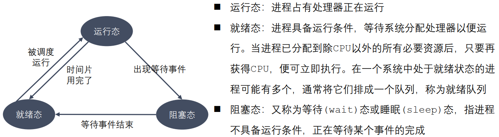

​	2.五态分类

​		在三态的基础上增加了进程的新建与终止

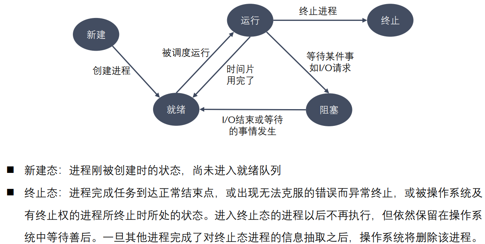

#### 2.1.1进程查看

##### 查看所有进程

```shell
ps aux / ajx
#a：显示终端上的所有进程，包括其他用户的进程
#u：显示进程的详细信息
#x：显示没有控制终端的进程
#j：列出与作业控制相关的信息
```

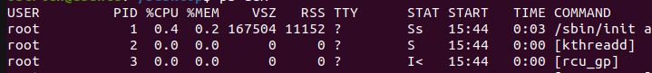

**STAT含义：**

| R     | 正在运行，或在队列中的进程                 |
| ----- | ------------------------------------------ |
| **S** | **处于休眠状态**                           |
| **D** | **不可中断 Uninterruptible（usually IO）** |
| **Z** | **僵尸进程**                               |

##### 查看实时进程

```shell
top (-d)
#-d 可以指定显示信息更新时间间隔
#执行后，按下对应大写可以排序
# M 根据内存使用量排序
# P 根据 CPU 占有率排序
# T 根据进程运行时间长短排序
# U 根据用户名来筛选进程
# K 输入指定的 PID 杀死进程
```

##### 杀死进程

```shell
kill [-signal] pid #根据信号杀死对应pid进程
kill –l 列出所有signal
kill –SIGKILL/-9 pid #强制杀死pid进程

killall name #根据进程名杀死进程
```

##### 查看进程号相关函数

```C++
pid_t getpid(void); 
pid_t getppid(void); //获取父进程pid
pid_t getpgid(pid_t pid); //获取关联进程的组进程pid
```

#### 2.1.2创建进程

```c++
pid_t fork();
//返回值有两个
//	1.大于0，表示是子进程的pid，等于0，表示该进程是子进程
//	2.返回-1，表示创建进程失败（失败原因：1.内存不够；2.进程数目已经达到上限）
```

fork（）原理解释：相当于克隆一个虚拟地址空间，用户区数据一样，但是内核区pid有区别；

- 父子进程虽然是“父子”，但是在各自独立的虚拟地址空间进行操作，互不影响（即子进程数据修改不影响父进程数据）
- 通过执行 fork系统调用，子进程获得父进程中数据空间，堆和栈等的副本，但它们并不共享存储空间，只共享代码段。由于把当前运行的位置都复制到子进程 ，那么子进程当然也是接着fork继续执行。

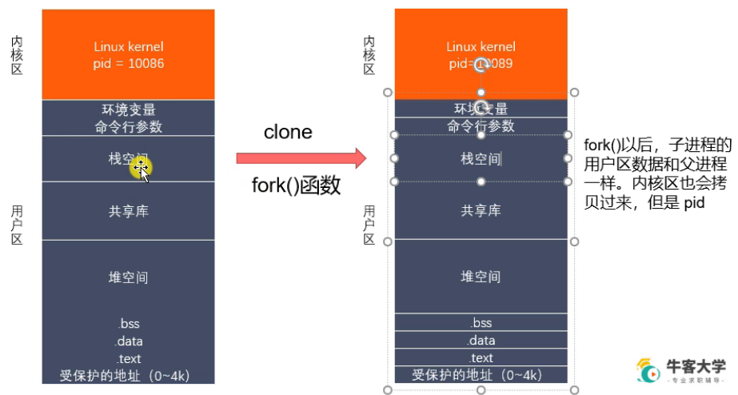

##### 写时拷贝

调用fork函数创建子进程，采用的主要技术是“写时拷贝”（copy-on-write）：在创建子进程的时候并不会直接克隆，而是将子进程的页表项指向与父进程相同的物理页，这也只需要拷贝父进程的页表项就可以了，不会复制整个内存地址空间，同时把这些页表项标记为只读。如果父子进行都不对页面进行操作，那么便一直共享同一份物理页面。只要父子进程有一个尝试进行修改某一个页面，那么就会发生缺页异常（page fault）。那么内核便会为该页面创建一个新的物理页面，并将内容复制到新的物理页面中，让父子进程真正地各自拥有自己的物理内存页面，并将页表中相应地页表项标记为可写。

**（虽然两个进程访问的对象的虚拟地址（页表项）相同，但是由于写的时候复制了一份页面，所以实际物理地址发生了变化）**

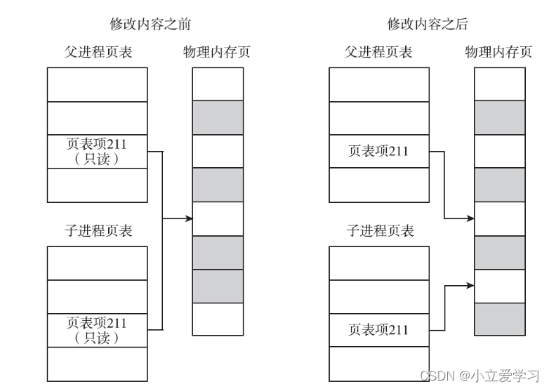

父进程先结束，子进程变为孤儿进程，如果退出时无法释放资源，变为僵尸进程，在Linux中为了避免这种情况，由init进程进行“收养”。

##### GDB调试

```shell
#默认跟踪父进程
set follow-fork-mode [parent | child]  #设置GDB跟踪进程
set detach-on-fork [on | off]  #使当前进程脱离GDB调试
    
#查看调试的进程
info inferiors 

#切换当前调试的进程
inferior id #info中的num

#使进程脱离 GDB 调试
detach inferiors id 
```

##### exec()函数族

exec() 函数族的作用是根据指定的文件名找到可执行文件，并用它来取代调用进程的内容，换句话说，就是在调用进程内部执行一个可执行文件。  

exec() 函数族的函数执行成功后不会返回，因为调用进程的实体，包括代码段，数据段和堆栈等都已经被新的内容取代，只留下进程 ID 等一些表面上的信息仍保持原样。只有调用失败返回 -1，从原程序的调用点接着往下执行。

**一般不会在主进程中调用exec() 函数，而是先由fork创建子进程调用。**

```c++
//参数列表以NULL结尾
int execl(const char *path, const char *arg, .../* (char *) NULL */); //常用，path用绝对地址
int execlp(const char *file, const char *arg, ... /* (char *) NULL */); //常用，通过环境变量执行文件
int execle(const char *path, const char *arg, .../*, (char *) NULL, char *const envp[] */);

int execv(const char *path, char *const argv[]);
int execvp(const char *file, char *const argv[]);
int execvpe(const char *file, char *const argv[], char *const envp[]);
int execve(const char *filename, char *const argv[], char *const envp[]);

//l(list) 参数地址列表，以空指针结尾
//v(vector) 存有各参数地址的指针数组的地址
//p(path) 按 PATH 环境变量指定的目录搜索可执行文件
//e(environment) 存有环境变量字符串地址的指针数组的地址
```

#### 2.1.3进程状态

- 进程退出：需要进程退出时，调用进程退出函数，一般采用exit()
  - void exit(int status); 一般status为0，表示正常退出，非0表示非正常退出。
  - exit属于系统调用级别，表示一个进程的结束
  - return属于语言级别，属于返回函数值并推出函数

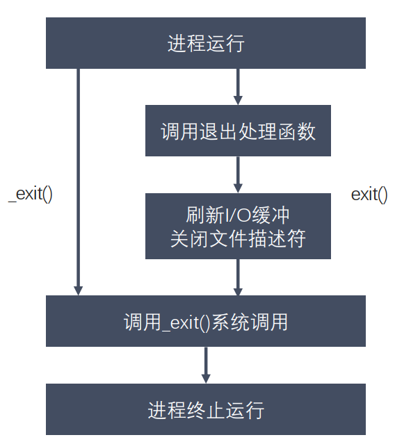

```C++
#include <stdlib.h>
void exit(int status);//标准C库函数

#include <unistd.h>
void _exit(int status);

//当子进程退出时，状态通过status传递给父进程
```

- 孤儿进程：父进程已经结束，而子进程还没结束——由init进程进行监管，wait()等待子进程结束，之后回收资源

- 僵尸进程：子进程结束，父进程没有回收，子进程的残留资源成为僵尸进程，占用大量进程号——父进程wait()/waitpid()处理

#### 2.1.4进程回收

在每个进程退出的时候，内核释放该进程所有的资源、包括打开的文件、占用的内存等。但是仍然为其保留一定的信息，这些信息主要主要指进程控制块PCB的信息（包括进程号、退出状态、运行时间等）。  

父进程可以通过调用wait或waitpid得到它的退出状态同时彻底清除掉这个进程。

wait() 和 waitpid() 函数的功能一样，区别在于wait() 函数会**阻塞**调用方，waitpid() **可以设置不阻塞**， waitpid() 还可以指定等待哪个子进程结束。
**注意：一次wait或waitpid调用只能清理一个子进程，清理多个子进程应使用循环。**  

```C++
#include <sys/types.h>
#include <sys/wait.h>

pid_t wait(int *status);
//返回：成功返回子进程ID，出错返回-1
//功能：等待子进程退出并回收，防止孤儿进程产生。

pid_t waitpid(pid_t pid, int *status, int options);
//返回：成功返回子进程ID，出错返回-1
//功能：wait函数的非阻塞版本。
```

**wait()状态宏**

- WIFEXITED(status) / WEXITSTATUS(status)
  - 判断是否正常终止
  - 若为正常终止子进程返回的状态，则为真
- WIFSIGNALED(status) / WTERMSIG(status)
  - 若为异常终止子进程返回的状态，则为真(接到一个使进程终止的信号)
- WIFSTOPED(status) / WSTOPSIG(status)
  - 判断子程序是否暂停过
  - 若为当前暂停子进程返回的状态，则为真

### 2.2进程通信

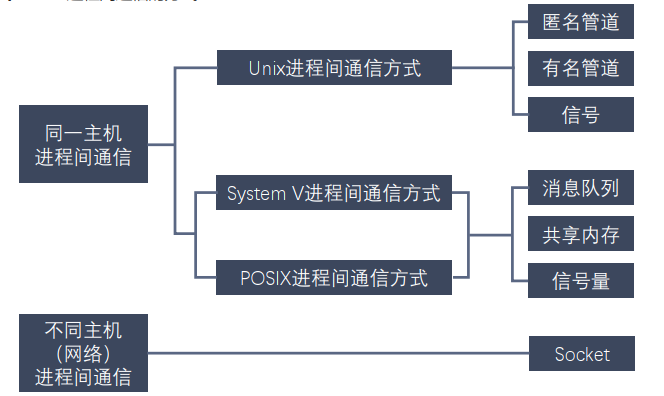

#### 2.2.1匿名管道（pipe）

[**Linux管道**](https://yngzmiao.blog.csdn.net/article/details/81569852?spm=1001.2101.3001.6650.1&utm_medium=distribute.pc_relevant.none-task-blog-2%7Edefault%7ECTRLIST%7Edefault-1-81569852-blog-123117549.pc_relevant_default&depth_1-utm_source=distribute.pc_relevant.none-task-blog-2%7Edefault%7ECTRLIST%7Edefault-1-81569852-blog-123117549.pc_relevant_default&utm_relevant_index=1)

最早的进程通信方式，符号为 `|`，例如`ls | wc –l  `（统计一个目录中文件个数），shell 创建了两个进程来分别执行 ls 和 wc。  

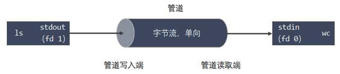

管道特点：

- 管道其实是一个在内核内存中维护的缓冲器，这个缓冲器的存储能力是有限的，不同的操作系统大小不一定相同，且由于读写操作，管道采用环形结构，用读指针和写指针控制读和写操作
- 管道拥有文件的特质：读操作、写操作，**匿名管道没有**文件实体，**有名管道有**文件实体，但**不存储数据**。可以按照操作文件的方式对管道进行操作
- 一个管道是一个字节流，使用管道时不存在消息或者消息边界的概念，从管道读取数据的进程可以读取任意大小的数据块，而不管写入进程写入管道的数据块的大小是多少
- 通过管道传递的数据是顺序的，从管道中读取出来的字节的顺序和它们被写入管道的顺序是完全一样的  
- 管道属于半双工通信，一端用于读取数据，一端用于写数据，且读数据属于一次性操作，一旦读走即被抛弃，且无法用lseek在管道中访问数据
- 匿名管道只能在具有公共祖先的进程（父进程与子进程，或者两个兄弟进程，具有亲缘关系）之间使用

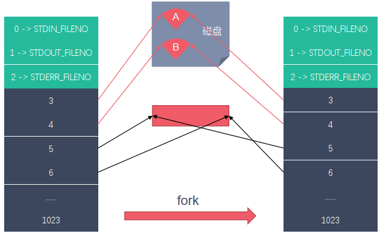

```C++
//创建管道
#include <unistd.h>
int pipe(int pipefd[2]); //pipefd[2]表示pipe管道两端，fd[0]表示管道读端，fd[1]表示管道写端

//查看管道缓冲大小命令
ulimit –a

//查看管道缓冲大小函数
#include <unistd.h>
long fpathconf(int fd, int name);
```


#### 2.2.2有名管道（fifo）

与匿名管道的区别在于：可以在无关进程间建立通信，有文件实体但不存储任何内容

```C++
//通过命令创建有名管道
mkfifo fifo_name

//通过函数创建有名管道
#include <sys/types.h>
#include <sys/stat.h>
int mkfifo(const char *pathname, mode_t mode);
```

一旦使用 mkfifo 创建了一个 FIFO，就可以使用 open 打开它，常见的文件I/O 函数都可用于 fifo。如：close()、read()、write()、unlink() 等。

FIFO 严格遵循先进先出（First in First out），对管道及 FIFO 的读总是从开始处返回数据，对它们的写则把数据添加到末尾。不支持诸如 lseek()等文件定位操作

#### 2.2.3管道进程通信

**管道的读写特点：**

使用管道时，需要注意以下几种特殊的情况（假设都是阻塞I/O操作）

1. 所有的指向管道**写端的文件描述符都关闭**了（管道写端引用计数为0），有进程从管道的读端读数据，那么管道中剩余的数据被读取以后，再次read会返回0，就像读到文件末尾一样。
2. 如果有指向管道写端的文件描述符没有关闭（管道的写端引用计数大于0），而持有管道写端的进程也没有往管道中写数据，这个时候有进程从管道中读取数据，那么管道中剩余的数据被读取后，再次read会阻塞，直到管道中有数据可以读了才读取数据并返回。
3. 如果所有指向管道**读端的文件描述符都关闭**了（管道的读端引用计数为0），这个时候有进程向管道中写数据，那么该进程会收到一个信号SIGPIPE, 通常会导致进程异常终止。
4. 如果有指向管道读端的文件描述符没有关闭（管道的读端引用计数大于0），而持有管道读端的进程也没有从管道中读数据，这时有进程向管道中写数据，那么在管道被写满的时候再次write会阻塞，直到管道中有空位置才能再次写入数据并返回。

**总结：**

**读管道：**

- 管道中有数据，read返回实际读到的字节数。

- 管道中无数据：

  - 写端被全部关闭，read返回0（相当于读到文件的末尾）

  - 写端没有完全关闭，read阻塞等待

**写管道：**

- 管道读端全部被关闭，进程异常终止（进程收到SIGPIPE信号）

- 管道读端没有全部关闭：

  - 管道已满，write阻塞

  - 管道没有满，write将数据写入，并返回实际写入的字节数

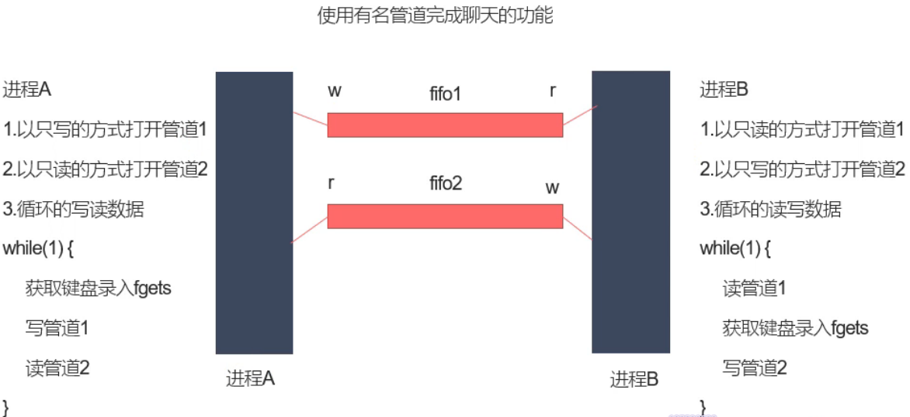

#### 2.2.4内存映射

内存映射（Memory-mapped I/O）是将磁盘文件的数据映射到内存，用户通过修改内存就能修改磁盘文件。

主要作用：1.进程间通信；2.拷贝文件（较小的文件）

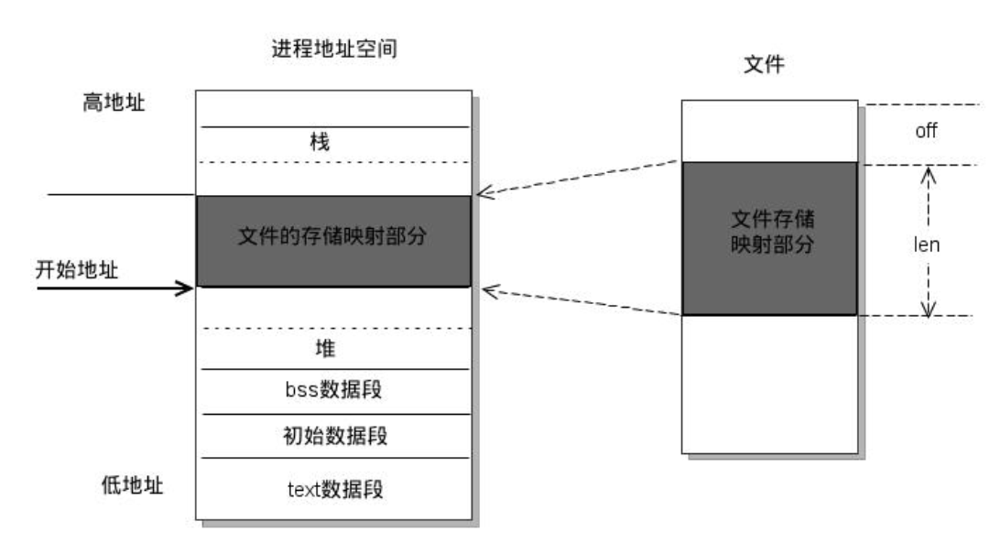

```C++
#include <sys/mman.h>
//创建映射内存文件
void *mmap(void *addr, size_t length, int prot, int flags, int fd, off_t offset);
//	addr: NULL, 由内核指定
//	length : 要映射的数据的长度，这个值不能为0。建议使用文件的长度(stat, lseek)。
//	prot : 对申请的内存映射区的操作权限要操作映射内存，必须要有读的权限(PROT_READ、PROT_READ|PROT_WRITE)
//      -PROT_EXEC ：可执行的权限
//		-PROT_READ ：读权限
//		-PROT_WRITE ：写权限
//		-PROT_NONE ：没有权限
//	flags :
//		- MAP_SHARED : 映射区的数据会自动和磁盘文件进行同步，进程间通信，必须要设置这个选项
//		- MAP_PRIVATE ：不同步，内存映射区的数据改变了，对原来的文件不会修改，会重新创建一个新的文件。（copy on write）
//	fd: 需要映射的那个文件的文件描述符,通过open得到，open的是一个磁盘文件，如果采用匿名映射，则为-1
//	offset：偏移量，一般不用。必须指定的是4k的整数倍，0表示不偏移。
//	返回值：返回创建的内存的首地址,失败返回MAP_FAILED，(void *) -1
                        
//释放映射内存
int munmap(void *addr, size_t length);
```

##### 2.2.4.1常见问题

**1.如果对mmap的返回值(ptr)做++操作(ptr++), munmap是否能够成功?**

​		void * ptr = mmap(...);
​		ptr++;  可以对其进行++操作
​		munmap(ptr, len);   // 错误,要保存地址

**2.如果open时O_RDONLY, mmap时prot参数指定PROT_READ | PROT_WRITE会怎样?**
		错误，返回MAP_FAILED
		open()函数中的权限建议和prot参数的权限保持一致。

**3.如果文件偏移量为1000会怎样?**
		偏移量必须是4K的整数倍，返回MAP_FAILED

**4.mmap什么情况下会调用失败?**

 		   - 第二个参数：length = 0
   - ​	第三个参数：prot
        - 只指定了写权限
        - prot PROT_READ | PROT_WRITE
              通过open函数时指定的 O_RDONLY / O_WRONLY

**5.可以open的时候O_CREAT一个新文件来创建映射区吗?**

   - 可以的，但是创建的文件的大小如果为0的话，肯定不行
		    - 可以对新的文件进行扩展
		    - 可- lseek()
	- truncate()

**6.mmap后关闭文件描述符，对mmap映射有没有影响？**
  	  int fd = open("XXX");
  	  mmap(,,,,fd,0);
		close(fd); 
 	   映射区还存在，创建映射区的fd被关闭，没有任何影响。

**7.对ptr越界操作会怎样？**
	void * ptr = mmap(NULL, 100,,,,,);
	4K
	越界操作操作的是非法的内存 -> 段错误

### 2.3进程信号

信号本质上属于一种软件中断，是一种对进程的通知，信号的产生包括以下几种情况：

- 对于前台进程，用户可以通过输入特殊的终端字符来给它发送信号。比如输入Ctrl+C通常会给进程发送一个中断信号。
- 硬件发生异常，即硬件检测到一个错误条件并通知内核，随即再由内核发送相应信号给相关进程。比如执行一条异常的机器语言指令，诸如被 0 除，或者引用了无法访问的内存区域。
- 系统状态变化，比如 alarm 定时器到期将引起 SIGALRM 信号，进程执行的 CPU时间超限，或者该进程的某个子进程退出。
- 运行 kill 命令或调用 kill 函数。  
- 常见信号状态：送达、未决、阻塞

常见信号：

| 编号 | 信号名称 |                           对应事件                           |       默认动作(5种)        |
| :--: | :------: | :----------------------------------------------------------: | :------------------------: |
|  2   |  SIGINT  | 当用户按下了<Ctrl+C>组合键时，用户终端向正在运行中的由该终端启动的程序发出此信号 |        **终止进程**        |
|  3   | SIGQUIT  | 用户按下<Ctrl+\\>组合键时产生该信号，用户终端向正在运行中的由该终端启动的程序发出些信号 |          终止进程          |
|  9   | SIGKILL  |         无条件终止进程。该信号不能被忽略，处理和阻塞         | 终止进程，可以杀死任何进程 |
|  11  | SIGSEGV  |              指示进程进行了无效内存访问(段错误)              | **终止进程并产生core文件** |
|  13  | SIGPIPE  |            Broken pipe向一个没有读端的管道写数据             |          终止进程          |
|  17  | SIGCHLD  |              子进程结束时，父进程会收到这个信号              |        忽略这个信号        |
|  18  | SIGCONT  |                如果进程已停止，则使其继续运行                |       **继续/忽略**        |
|  19  | SIGSTOP  |          停止进程的执行。信号不能被忽略，处理和阻塞          |         为终止进程         |
|  20  | SIGTSTP  |   停止终端交互进程的运行。按下<ctrl+z>组合键时发出这个信号   |        **暂停进程**        |

注意：

- SIGKILL 和 SIGSTOP 信号**不能**被捕捉、阻塞或者忽略，只能执行默认动作。  
- core文件的查看方式：gdb调试，然后输入指令`core-fire core`，进行查看。

#### 2.3.1信号相关函数

```C
int kill(pid_t pid, int sig);
int raise(int sig);
void abort(void);
unsigned int alarm(unsigned int seconds);
int setitimer(int which, const struct itimerval *new_val, struct itimerval *old_value);
sighandler_t signal(int signum, sighandler_t handler);
int sigaction(int signum, const struct sigaction *act, struct sigaction *oldact);
```

#### 2.3.2信号集函数

信号集：一种特殊的**数据结构**，数据类型为 sigset_t，用来表示一组不同的多个信号

在 PCB 中有两个非常重要的信号集。一个称之为 “阻塞信号集” ，另一个称之为“未决信号集” 。这两个信号集都是内核使用位图机制来实现的。但操作系统不允许直接对这两个信号集进行位操作。而需自定义另外一个集合，借助信号集操作函数来对 PCB 中的这两个信号集进行修改。

- 信号的 “未决” 是一种状态，指的是从信号的产生到信号被处理前的这一段时间。
- 信号的 “阻塞” 是一个开关动作，指的是阻止信号被处理，但不是阻止信号产生。
- 信号的阻塞就是让系统暂时保留信号留待以后发送。由于另外有办法让系统忽略信号，所以一般情况下信号的阻塞只是暂时的，只是为了防止信号打断敏感的操作  

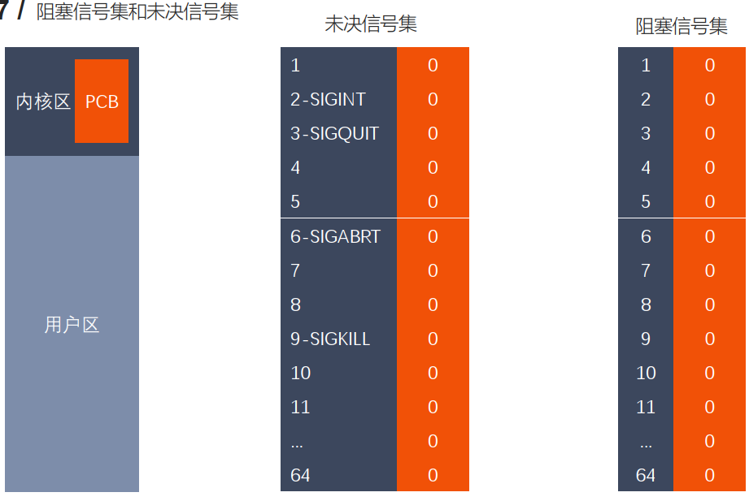

```C
int sigemptyset(sigset_t *set);
int sigfillset(sigset_t *set);
int sigaddset(sigset_t *set, int signum);
int sigdelset(sigset_t *set, int signum);
int sigismember(const sigset_t *set, int signum);
int sigprocmask(int how, const sigset_t *set, sigset_t *oldset);//把自己设定的set修改到阻塞信号集
int sigpending(sigset_t *set);//把未决信号集取出
```

- 后台执行进程：命令后加“&”， 例如`./xx`，则文件在后台运行，结果在前台显示；
- 切换到前台：输入fg即可

**内核信号捕捉过程：**

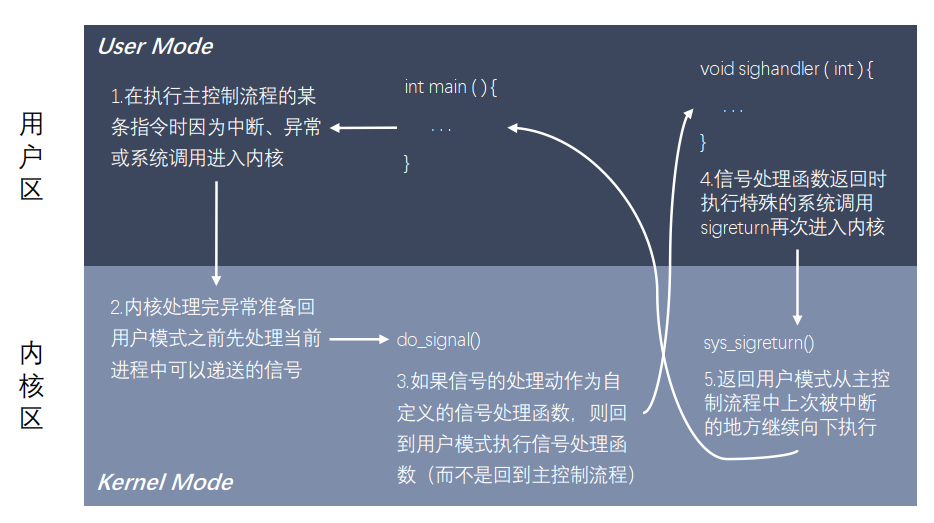

**SIGCHLD信号产生的条件：**

- 子进程终止时
- 子进程接收到 SIGSTOP 信号停止时
- 子进程处在停止态，接受到SIGCONT后唤醒时

以上三种条件都会给父进程发送 SIGCHLD 信号，父进程默认会忽略该信号  

### 2.4共享内存

共享内存允许两个或者多个进程共享物理内存的同一块区域（通常被称为段）。由于一个共享内存段会称为一个进程用户空间的一部分，因此这种 IPC 机制无需内核介入。所有需要做的就是让一个进程将数据复制进共享内存中，并且这部分数据会对其他所有共享同一个段的进程可用。

与管道等要求发送进程将数据从用户空间的缓冲区复制进内核内存和接收进程将数据从内核内存复制进用户空间的缓冲区的做法相比，这种 IPC 技术的速度更快。 

#### 2.4.1共享内存操作

- 调用 shmget() 创建一个新共享内存段  
- 使用 shmat() 使进程附着共享内存段  
- 调用 shmdt() 来分离进程与共享内存段  
- 调用 shmctl() 来删除共享内存段  

```C
int shmget(key_t key, size_t size, int shmflg);
void *shmat(int shmid, const void *shmaddr, int shmflg);
int shmdt(const void *shmaddr);
int shmctl(int shmid, int cmd, struct shmid_ds *buf);
key_t ftok(const char *pathname, int proj_id);
```

#### 2.4.2ipc操作

```c
ipcs命令用于报告Linux中进程间通信设施的状态，显示的信息包括消息列表、共享内存和信号量的信息。
ipcs用法
    ipcs -a // 打印当前系统中所有的进程间通信方式的信息
    ipcs -m // 打印出使用共享内存进行进程间通信的信息
    ipcs -q // 打印出使用消息队列进行进程间通信的信息
    ipcs -s // 打印出使用信号进行进程间通信的信息
    
ipcrm命令用于移除一个消息对象。或者共享内存段，或者一个信号集，同时会将与ipc对象相关链的数据也一起移除。只有超级管理员，或者ipc对象的创建者才有这项权利
ipcrm用法
    ipcrm -M shmkey // 移除用shmkey创建的共享内存段
    ipcrm -m shmid // 移除用shmid标识的共享内存段
    ipcrm -Q msgkey // 移除用msqkey创建的消息队列i
    ipcrm -q msqid // 移除用msqid标识的消息队列
    ipcrm -S semkey // 移除用semkey创建的信号
    ipcrm -s semid // 移除用semid标识的信号
```

### 2.5守护进程

一个进程一般具有以下ID：

- PID：进程的唯一标识。对于多线程的进程而言，所有线程调用getpid函数会返回相同的值。
- PGID：进程组ID。每个进程都会有进程组ID，表示该进程所属的进程组。默认情况下新创建的进程会继承父进程的进程组ID。
- SID：会话ID。每个进程也都有会话ID。默认情况下，新创建的进程会继承父进程的会话ID。

#### 2.5.1终端、进程组、会话

- 终端（termimal）：作用是提供一个命令的输入输出环境

  shell：是一个命令行解释器，是linux内核的一个外壳,负责外界与linux内核的交互

  通过终端登录系统后，自动生成一个shell进程，终端此时转化为shell进程的控制终端，信息保存在shell进程的PCB中，所以 通过shell进程fork出的进程都有一个共同的控制终端，在控制终端输入一些特殊的控制键可以给前台进程发信号，  例如 `Ctrl + C `会产生 SIGINT 信号， `Ctrl + \ `会产生 SIGQUIT 信号。  

- 进程组：一组相关进程的集合

  由一个或多个共享同一进程组标识符（PGID）的进程组成。一个进程组拥有一个进程组首进程，该进程是创建该组的进程，其进程 ID 为该进程组的 ID，新进程会继承其父进程所属的进程组 ID。  

  进程组生命周期：首进程创建组到最后一个进程退出组（进程终止或者进程加入其他组），首进程不需要是最后退出的进程。

- 会话：一组相关进程组的集合。

  会话首进程是创建该新会话的进程，其进程 ID 会成为会话 ID。新进程会继承其父进程的会话 ID  

  终端与会话关系：一个会话中的所有进程共享单个控制终端。在会话首进程首次打开一个终端设备时建立控制终端。一个终端最多可能会成为一个会话的控制终端  

  在任一时刻，会话中的其中一个进程组会成为终端的前台进程组，其他进程组会成为后台进程组。只有前台进程组中的进程才能从控制终端中读取输入。当用户在控制终端中输入终端字符生成信号后，该信号会被发送到前台进程组中的所有成员。当控制终端的连接建立起来之后，**会话首进程**会成为该终端的控制进程 。

  ```shell
  find / 2 > /dev/null | wc -l &
  sort < longlist | uniq -c  
  ```

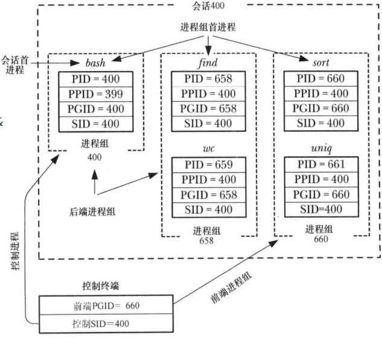

相关操作函数：

```C++
pid_t getpgrp(void);//获取当前进程组ID
pid_t getpgid(pid_t pid);//获得进程组ID
int setpgid(pid_t pid, pid_t pgid);//设置进程组ID
pid_t getsid(pid_t pid);//获得会话ID
pid_t setsid(void);//设置会话ID
```

#### 2.5.2守护进程

守护进程（Daemon Process），也就是通常说的 Daemon 进程（精灵进程），是Linux 中的后台服务进程。它是一个生存期较长的进程，通常独立于控制终端并且周期性地执行某种任务或等待处理某些发生的事件。一般采用以 d 结尾的名字。有以下特征：

- 生命周期很长，守护进程会在系统启动的时候被创建并一直运行直至系统被关闭 
- 它在后台运行并且不拥有控制终端。没有控制终端确保了内核永远不会为守护进程自动生成任何控制信号以及终端相关的信号（如 SIGINT、 SIGQUIT） 

Linux的大多数服务器就是用守护进程实现的。比如，Internet服务器inetd，Web服务器httpd等 。

用户在执行命令时，可以在**命令的结尾**添加“&”符号，表示将命令放入**后台执行**。这样该命令对应的进程组即为后台进程组。

##### 2.5.2.1创建步骤

1. 执行一个 fork()，之后父进程退出，子进程继续执行  
2. 子进程调用 setsid() 开启一个新会话  
3. 清除进程的 umask 以确保当守护进程创建文件和目录时拥有所需的权限
4. 修改进程的当前工作目录，通常会改为根目录（/）  
5. 关闭守护进程从其父进程继承而来的所有打开着的文件描述符  
6. 在关闭了文件描述符0、 1、 2之后，守护进程通常会打开/dev/null 并使用dup2()使所有这些描述符指向这个设备  
7. 核心业务逻辑  

```shell
//Linuxs终端指令
tty命令  显示当前终端对应终端设备文件
who命令  查看当前系统上登录的所有账号c
echo $$  返回登录shell的PID
```

## 3.多线程开发

### 3.1线程操作

线程（thread）是允许应用程序并发执行多个任务的一种机制。一个进程可以包含多个线程。同一个程序中的所有线程均会独立执行相同程序，且共享同一份全局内存区域，其中包括初始化数据段、未初始化数据段，以及堆内存段。（传统意义上的 UNIX 进程只是多线程程序的一个特例，该进程只包含一个线程）  

- 进程是 CPU 分配资源的最小单位，线程是操作系统调度执行的最小单位 
- 线程是轻量级的进程（LWP： Light Weight Process），Linux 环境下线程的本质仍是进程
- 查看指定进程的LWP号：`ps –Lf pid`  

|          |                             进程                             |                             线程                             |
| :------- | :----------------------------------------------------------: | :----------------------------------------------------------: |
| 信息共享 | 信息难以共享（父子进程也只是共享代码段，需要进程间通信进行信息交换） |      能够方便、快速地共享信息（将数据复制到共享变量中）      |
| 创建成本 | 调用 fork() 来创建进程的代价相对较高（复制内存页表和文件描述符） | 创建线程比创建进程通常要快 10 倍甚至更多（共享虚拟地址空间） |

#### 3.1.1线程间资源

- 共享资源
  - 进程 ID 和父进程 ID
  - 进程组 ID 和会话 ID
  - 用户 ID 和 用户组 ID
  - 文件描述符表
  - 信号处置
  - 文件系统的相关信息：文件权限掩码（umask）、当前工作目录
  - 虚拟地址空间（除栈、 .text）  
- 非共享资源
  - 线程 ID
  - 信号掩码
  - 线程特有数据
  - error 变量
  - 实时调度策略和优先级
  - 栈，本地变量和函数的调用链接信息  

#### 3.1.2线程操作

一个包括 IBM 的开发人员的团队开展了 NGPT（Next-Generation POSIX Threads）项目。同时， Red Hat 的一些开发人员开展了 NPTL 项目。 NGPT在 2003 年中期被放弃了，把这个领域完全留给了 NPTL。

NPTL，或称为 Native POSIX Thread Library，是 Linux 线程的一个新实现，它克服了 LinuxThreads 的缺点，同时也符合 POSIX 的需求。与 LinuxThreads 相比，它在性能和稳定性方面都提供了重大的改进。

查看当前 pthread 库版本： `getconf GNU_LIBPTHREAD_VERSION`

编译线程文件时，由于线程操作函数库属于第三方库，因此需要加上`-l pthread` ，也可以直接写`-pthread` 进行编译。

```c++
int pthread_create(pthread_t *thread, const pthread_attr_t *attr, void *(*start_routine) (void *), void *arg);
pthread_t pthread_self(void);
int pthread_equal(pthread_t t1, pthread_t t2);
void pthread_exit(void *retval);
int pthread_join(pthread_t thread, void **retval);//等待线程结束，retval存储被等待线程的返回值，阻塞
int pthread_detach(pthread_t thread);
int pthread_cancel(pthread_t thread);
```

- exit()用在线程内，代表当前线程退出
- join()在主线程中，往往代表要等到子线程结束后结束（阻塞）
- detach()代表分离线程（守护线程），线程分离到后台运行

#### 3.1.3线程属性（pthread_attr_t）

```C++
int pthread_attr_init(pthread_attr_t *attr);
int pthread_attr_destroy(pthread_attr_t *attr);
int pthread_attr_getdetachstate(const pthread_attr_t* attr, int* detachstate);
int pthread_attr_setdetachstate(pthread_attr_t* attr, int detachstate);
```

### 3.2线程同步

线程的主要优势在于，能够通过全局变量来共享信息。不过，这种便捷的共享是有代价的：必须确保多个线程不会同时修改同一变量，或者某一线程不会读取正在由其他线程修改的变量。

**临界区**是指访问某一共享资源的代码片段，并且这段代码的执行应为原子操作，也就是同时访问同一共享资源的其他线程不应终端该片段的执行。

线程同步：即当有一个线程在对内存进行操作时，其他线程都不可以对这个内存地址进行操作，直到该线程完成操作，其他线程才能对该内存地址进行操作，而其他线程则处于等待状态。  

#### 3.2.1互斥量

为避免线程更新共享变量时出现问题，可以使用互斥量（mutex 是 mutual exclusion的缩写）来确保同时仅有一个线程可以访问某项共享资源。可以使用互斥量来保证对任意共享资源的原子访问。

互斥量有两种状态：已锁定（locked）和未锁定（unlocked）。任何时候，至多只有一个线程可以锁定该互斥量。试图对已经锁定的某一互斥量再次加锁，将可能阻塞线程或者报错失败，具体取决于加锁时使用的方法。

一旦线程锁定互斥量，随即成为该互斥量的所有者，只有所有者才能给互斥量解锁。一般情况下，对每一共享资源（可能由多个相关变量组成）会使用不同的互斥量，每一线程在访问同一资源时将采用如下协议：

- 针对共享资源锁定互斥量
- 访问共享资源
- 对互斥量解锁  

如果多个线程试图执行这一块代码（一个临界区），事实上只有一个线程能够持有该互斥量（其他线程将遭到阻塞），即同时只有一个线程能够进入这段代码区域  

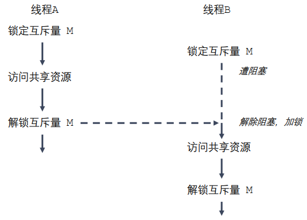

- 互斥量的类型：pthread_mutex_t 

```c++
int pthread_mutex_init(pthread_mutex_t *restrict mutex, const pthread_mutexattr_t *restrict attr);
int pthread_mutex_destroy(pthread_mutex_t *mutex);
int pthread_mutex_lock(pthread_mutex_t *mutex);
int pthread_mutex_trylock(pthread_mutex_t *mutex);
int pthread_mutex_unlock(pthread_mutex_t *mutex);
```

#### 3.2.2死锁

一个线程需要同时访问两个或更多不同的共享资源，而每个资源又都由不同的互斥量管理。当超过一个线程加锁同一组互斥量时，就有可能发生死锁  

两个或两个以上的进程在执行过程中，因争夺共享资源而造成的一种互相等待的现象，若无外力作用，它们都将无法推进下去。此时称系统处于死锁状态或系统产生了死锁。  

死锁的几种场景：

- 忘记释放锁
- 重复加锁
- 多线程多锁，抢占锁资源  


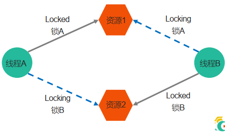

#### 3.2.3读写锁

当有一个线程已经持有互斥锁时，互斥锁将所有试图进入临界区的线程都阻塞住。但是考虑一种情形，当前持有互斥锁的线程只是要读访问共享资源，而同时有其它几个线程也想读取这个共享资源，但是由于互斥锁的排它性，所有其它线程都无法获取锁，也就无法读访问共享资源了，但是实际上多个线程同时读访问共享资源并不会导致问题。

在对数据的读写操作中，更多的是读操作，写操作较少，例如对数据库数据的读写应用。为了满足当前能够允许多个读出，但只允许一个写入的需求，线程提供了读写锁来实现。

 读写锁的特点：

- 如果有其它线程读数据，则允许其它线程执行读操作，但不允许写操作。
- 如果有其它线程写数据，则其它线程都不允许读、写操作。
- 写是独占的，写的优先级高  
- 读写锁的类型：pthread_rwlock_t  

```c++
int pthread_rwlock_init(pthread_rwlock_t *restrict rwlock, const pthread_rwlockattr_t *restrict attr);
int pthread_rwlock_destroy(pthread_rwlock_t *rwlock);
int pthread_rwlock_rdlock(pthread_rwlock_t *rwlock);
int pthread_rwlock_tryrdlock(pthread_rwlock_t *rwlock);
int pthread_rwlock_wrlock(pthread_rwlock_t *rwlock);
int pthread_rwlock_trywrlock(pthread_rwlock_t *rwlock);
int pthread_rwlock_unlock(pthread_rwlock_t *rwlock);
```

### 3.3生产者消费者模型

- 生产者：资源增加
- 消费者：资源减少

#### 3.3.1条件变量

条件变量的类型：pthread_cond_t  

```c++
int pthread_cond_init(pthread_cond_t *restrict cond, const pthread_condattr_t *restrict attr);
int pthread_cond_destroy(pthread_cond_t *cond);
int pthread_cond_wait(pthread_cond_t *restrict cond, pthread_mutex_t *restrict mutex);
int pthread_cond_timedwait(pthread_cond_t *restrict cond, pthread_mutex_t *restrict mutex, const struct timespec *restrict abstime);
int pthread_cond_signal(pthread_cond_t *cond);
int pthread_cond_broadcast(pthread_cond_t *cond);
```

#### 3.3.2信号量

信号量的类型：sem_t（类似于int的一种typedef，多个进程间共享）

```c++
int sem_init(sem_t *sem, int pshared, unsigned int value);
int sem_destroy(sem_t *sem);
int sem_wait(sem_t *sem);
int sem_trywait(sem_t *sem);
int sem_timedwait(sem_t *sem, const struct timespec *abs_timeout);
int sem_post(sem_t *sem);
int sem_getvalue(sem_t *sem, int *sval);
```

## 4.网络编程

### 4.1网络模型及协议

概念知识：[小林coding](https://xiaolincoding.com/network/1_base/tcp_ip_model.html#%E5%BA%94%E7%94%A8%E5%B1%82)

 [网络基础.pdf](Col 4\网络基础.pdf) 

### 4.2网络通信

 [socket通信基础.pdf](Col 4\socket通信基础.pdf) 

#### 4.2.1字节序通信

- 高地址位放高数据位：小端
- 低地址位放高数据位：大端
- 写/读内存由低到高，print输出的内容由左到右，由高到低

```C
//h - host 主机，主机字节序
//to - 转换成什么
//n - network 网络字节序
//s - short unsigned short
//l - long unsigned int

#include <arpa/inet.h>
// 转换端口
uint16_t htons(uint16_t hostshort); // 主机字节序 - 网络字节序
uint16_t ntohs(uint16_t netshort); // 网络字节序 - 主机字节序
// 转IP
uint32_t htonl(uint32_t hostlong); // 主机字节序 - 网络字节序
uint32_t ntohl(uint32_t netlong); // 网络字节序 - 主机字节序
```

#### 4.2.2socket通信

##### 4.2.2.1socket地址

**通用socket地址**

结构体sockaddr （旧）：因为sa_data[14]不够IPv6

```c++
#include <bits/socket.h>
struct sockaddr {
sa_family_t sa_family;
char sa_data[14];
};
typedef unsigned short int sa_family_t;
```

新：通用的 socket 地址结构体  

```c++
#include <bits/socket.h>
struct sockaddr_storage
{
sa_family_t sa_family;
unsigned long int __ss_align;
char __ss_padding[ 128 - sizeof(__ss_align) ];
};
typedef unsigned short int sa_family_t;
```

#### 4.2.3TCP通信

 [TCP三次握手四次挥手.pdf](Col 4\TCP三次握手四次挥手.pdf) 

### 4.3I/O多路复用(epoll)

 [IO多路复用.pdf](Col 4\IO多路复用.pdf) 

 [IO多路复用图解.pdf](Col 4\IO多路复用图解.pdf) 

### 4.4UDP通信、本地套接字

 [UDP通信、本地套接字.pdf](Col 4\UDP通信、本地套接字.pdf) 

## 5.项目实战

 [项目实战.pdf](Col 5\项目实战.pdf) 

 [写HTTP响应BUG解决.pdf](Col 5\写HTTP响应BUG解决.pdf) 
